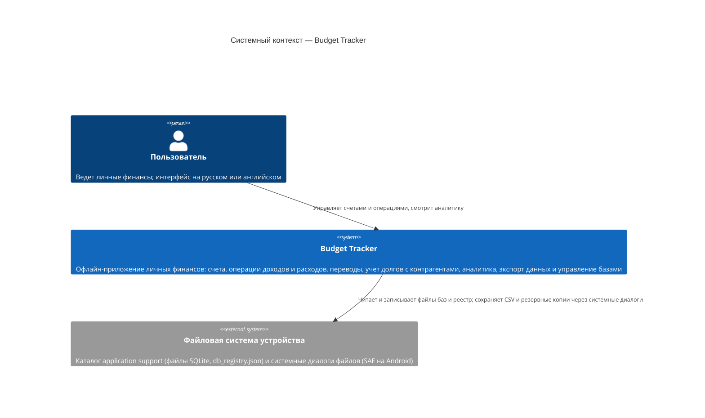
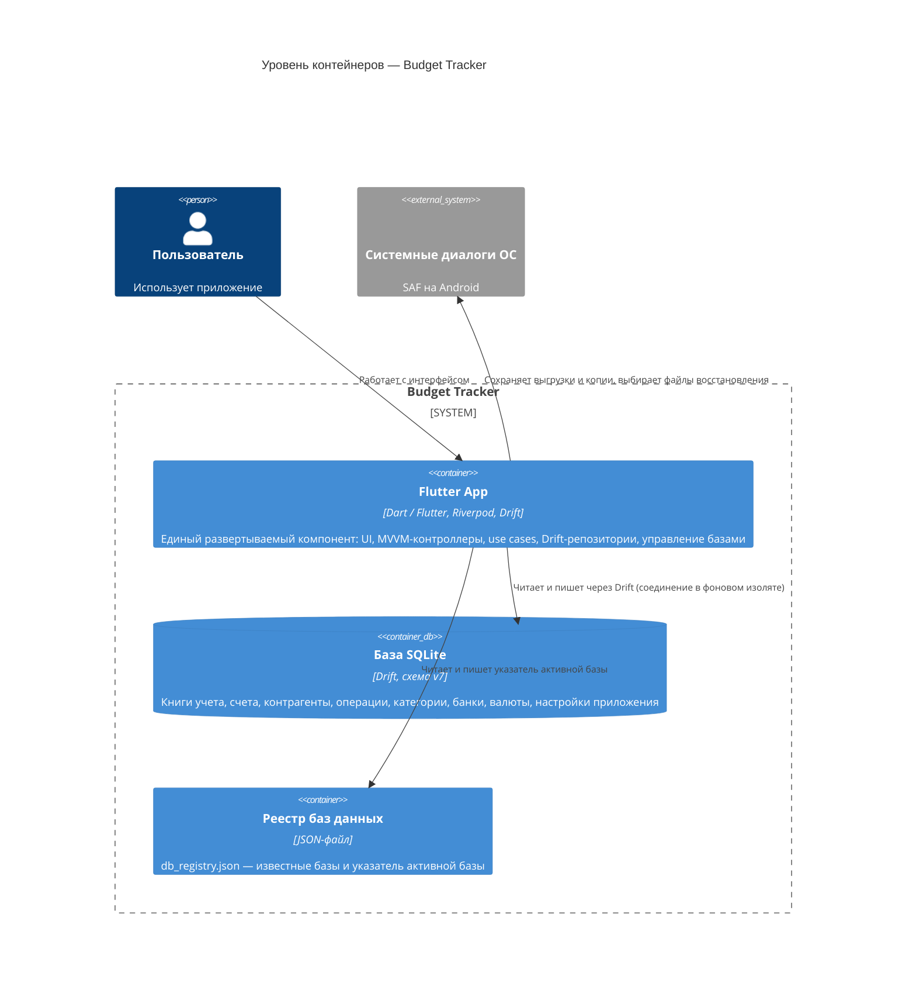
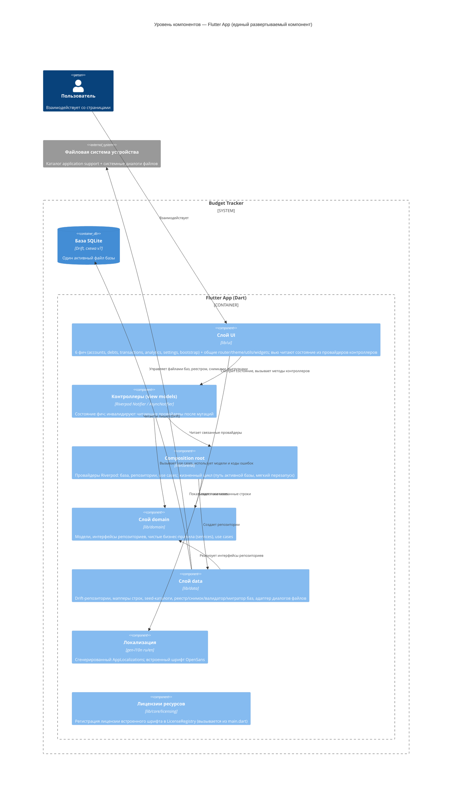

# Budget Tracker — архитектура (C4)

> **Статус:** реконструирована из кода, конфигурации и истории репозитория 2026-10-03; обновлена после реализации учета долгов 2026-10-04 (изменение OpenSpec архивировано).
> **Метод:** каждое утверждение опирается на фактическое дерево исходников; если код молчит и сделан вывод — он явно помечен. Артефакты OpenSpec рассматриваются как *намерение*, а не как реализованная архитектура.
> **Проверено при обновлении:** состав таблиц и миграции сверены с `AppDatabase`, размеры файлов и границы слоев — по дереву `lib/`, `flutter test` — 449 тестов проходят, `flutter build web --debug` — падает (см. раздел 2).

---

## 1. Область действия

Репозиторий — это **полный продукт**: одно offline-first приложение Flutter для учета личных финансов. Бэкенда, API-сервиса и общей платформы нет — все компоненты поставляются в одном приложении.

В области действия:

- Приложение Flutter ([lib/](/lib/)) — UI, доменная логика, доступ к данным.
- Локальное хранилище (SQLite через Drift, JSON-реестр баз данных).
- Каркасы сборки платформ Android, Windows и web.
- Архитектурные ADR ([docs/adr/](/docs/adr/)) и capability-спецификации OpenSpec, используемые только как *задокументированное намерение* для сверки с реализацией.

**Поддерживаемые платформы.** Единственная используемая и поддерживаемая платформа — **Android**. Платформы **web** и **windows** находятся в состоянии *suppressed*: их каталоги сохранены как каркас шаблона Flutter, но приложение для них не собирается и не тестируется. Сборка web в текущем виде невозможна (см. раздел 2), и это ожидаемо при политике «только Android».

Вне области действия (присутствует, но не является архитектурой времени выполнения):

- `.agents/`, `.cline/`, `.clinerules/`, `.continue/`, `.copilot/`, `.github/` — инструменты агентов и IDE. В [.github/](/.github/) нет пайплайнов CI — **автоматизированной сборки и тестов в репозитории нет**.
- `.widget_preview/` — сгенерированный каркас предпросмотра виджетов.
- `build/` — артефакты сборки.

---

## 2. Наблюдения из кодовой базы

Самые сильные конкретные сигналы в репозитории:

| Сигнал | Доказательство |
|---|---|
| Приложение Flutter, Dart SDK `^3.12.0` | [pubspec.yaml](/pubspec.yaml) |
| Слоистая структура: `core/`, `data/`, `domain/`, `ui/` (UI по фичам) | [lib/](/lib/), [ADR-0007](/docs/adr/0007-architecture-layers-and-directory-structure.md) |
| Состояние и DI через **Riverpod** (`flutter_riverpod ^3.4.3`): контроллеры `Notifier`/`AsyncNotifier`, composition root на провайдерах в [lib/core/di/](/lib/core/di) | код, например [finance_providers.dart](/lib/core/di/finance_providers.dart) |
| Хранилище: **Drift** (SQLite) через `drift_flutter`, версия схемы **7**, 8 таблиц | [app_database.dart](/lib/data/local/database/app_database.dart) |
| Полный **offline**: в `lib/` нет HTTP-клиентов, сокетов и внешних сервисов | набор зависимостей + поиск по `HttpClient`, `Socket`, `package:http`, `package:dio`, `WebSocket` не находит совпадений |
| «Иконки» банков рисуются локально (буква + фирменный цвет); `iconDomain` — только данные | [bank_avatar.dart](/lib/ui/features/accounts/widgets/bank_avatar.dart) |
| Деньги хранятся целыми **минорными единицами**; форматирование собственным кодом, пакета для денег нет | [money_formatter.dart](/lib/ui/core/utils/money_formatter.dart) |
| Поддержка нескольких баз: `db_registry.json` + указатель активной базы + мягкий перезапуск | [file_database_registry.dart](/lib/data/local/database/file_database_registry.dart), [ADR-0006](/docs/adr/0006-data-export-and-database-management.md) |
| Резервная копия через `VACUUM INTO`; конвейер восстановления: копия → проверка → миграция → активация | [drift_database_snapshot_service.dart](/lib/data/local/database/drift_database_snapshot_service.dart), [database_restore_usecases.dart](/lib/domain/usecases/database_restore_usecases.dart) |
| Локализация `ru`/`en` через `flutter gen-l10n`, русский — язык по умолчанию и fallback | [l10n.yaml](/l10n.yaml), [main.dart](/lib/main.dart) |
| Первый запуск: книга, банки, категории, валюты создаются одной транзакцией | [first_run_bootstrap_repository.dart](/lib/data/repositories/first_run_bootstrap_repository.dart) |
| Учет долгов: контрагенты книги с валютой, привязка операции к контрагенту, остаток считается из привязанных операций, четыре долговые роли у категорий | [app_database.dart](/lib/data/local/database/app_database.dart) (`Counterparties`, `Transactions.counterpartyId`, `Categories.debtRole`), [debt_balance_rule.dart](/lib/domain/services/debt_balance_rule.dart), [debt_usecases.dart](/lib/domain/usecases/debt_usecases.dart), [lib/ui/features/debts/](/lib/ui/features/debts) |
| 63 тестовых файла, зеркалящих `lib/` (unit + widget); 449 тестов, все проходят | [test/](/test/) |
| Каталоги платформ: `android/`, `windows/`, `web/`; `ios/`, `macos/`, `linux/` отсутствуют | корень репозитория, [.metadata](/.metadata) |
| **Сборка web не проходит**: `flutter build web --debug` → `Error: Dart library 'dart:ffi' is not available on this platform.` | проверено 2026-10-04; цепочка импорта `main.dart → drift → sqlite3 → dart:ffi`, дополнительно wasm dry run сообщает о тех же `dart:ffi`-модулях; причина — безусловный импорт `drift/native.dart` ([app_database.dart](/lib/data/local/database/app_database.dart), [drift_database_restore_validator.dart](/lib/data/local/database/drift_database_restore_validator.dart)) и `dart:io` в контрактах `domain/` |
| 12 capability-спецификаций OpenSpec; все изменения архивированы (9 записей в архиве, последняя — учет долгов) | [openspec/specs](/openspec/specs), [openspec/changes/archive](/openspec/changes/archive) |

Объем: 129 файлов Dart и ~22 тыс. строк в `lib/` (без сгенерированных `*.g.dart`); 63 тестовых файла и ~17 тыс. строк в `test/`.

---

## 3. Допущения и выводы

1. **Одна база данных = одна книга учета на практике.** Схема и доменная модель допускают несколько `Books` в одной базе, но UI всегда выбирает *первую книгу по дате создания* ([activeBookProvider](/lib/core/di/app_providers.dart)); управления книгами в UI нет.
2. **Единственная роль пользователя — владелец устройства.** В коде нет аутентификации, ролей и мультипользовательских концепций.
3. **Windows присутствует только как каркас.** Нативная поддержка SQLite + `path_provider` + `file_picker` делает Windows потенциально работоспособной, но ничто в репозитории этого не проверяет; по решению продукта платформа suppressed.

Факт «используется только Android» зафиксирован как решение владельца продукта, а не выводится из кода.

---

## 4. Системный контекст (System Context)

Система — персональный однопользовательский полностью офлайн-трекер финансов. Единственная внешняя система — файловая система устройства (каталог application support и системные диалоги файлов). Сторонних SaaS-зависимостей нет: шрифты — bundled-ресурсы, «иконки» банков рисуются из сохраненных цветов.

### Акторы и внешние системы

| Элемент | Тип | Примечания |
|---|---|---|
| Пользователь | Person | Владелец приложения; ролей и аутентификации нет |
| Файловая система устройства | Внешняя система | Две роли: (1) каталог application support для баз и реестра — доступ напрямую через `path_provider`; (2) пользовательские диалоги файлов для экспорта CSV, сохранения резервной копии и выбора файла восстановления — через `file_picker` (SAF на Android) |

**Граница доверия:** всё локально на одном устройстве; сетевого периметра, который нужно защищать, нет.

---

## 5. Уровень контейнеров (Container view)

Система состоит из одного развертываемого компонента (приложение Flutter) и двух видов локального хранения на устройстве.

Детали контейнеров:

- **Flutter App** — один процесс, один изолят UI плюс фоновый изолят Drift для соединения с активной базой. Кода вне процесса приложения нет.
- **База SQLite** — один файл на базу; приложение открывает ровно **одну активную базу за раз**. Обычная работа — через `drift_flutter` (фоновый изолят); проверка и миграция кандидатов на восстановление открывает файлы в текущем изоляте ([app_database.dart](/lib/data/local/database/app_database.dart): `AppDatabase`, `AppDatabase.forFile`).
- **Реестр баз данных** — `db_registry.json` (формат v1) в каталоге application support. Хранит известные базы (`id`, `fileName`, `createdAt`, `source`) и указатель активной. Самовосстанавливается: отсутствующий или нечитаемый реестр пересоздается; отсутствующий файл активной базы заменяется первой оставшейся записью ([file_database_registry.dart](/lib/data/local/database/file_database_registry.dart)).

### Схема базы данных (Drift, версия 7)

| Таблица | Назначение | Ключевые связи / примечательные колонки |
|---|---|---|
| `books` | Книги учета | `id` (UUIDv7), `name`, `isArchived` |
| `banks` | Справочник банков | `id`, `name`, `displayName`, `colorHex`, `iconDomain`, `isPreset`, `isArchived` |
| `accounts` | Счета с начальным остатком | `bookId → books`, `bankId → banks` (nullable), `currencyCode` (3 буквы), `initialBalanceMinor`, `isArchived`; индексы по книге и банку |
| `categories` | Деревья категорий доходов/расходов | `bookId → books`, `parentId → categories`, `kind`, `isFallback` (по одной на вид в книге), `debtRole` (nullable — признак долговой роли из четырех: заем/возврат × доход/расход), `isArchived` |
| `counterparties` | Контрагенты долга в разрезе книги и валюты | `bookId → books`, `name`, `currencyCode` (3 буквы), `isClosed` (признак ручного закрытия долга), `createdAt`/`updatedAt`; индекс по книге |
| `transactions` | Операции: доход, расход, перевод | `bookId`, `accountId → accounts`, `toAccountId → accounts` (nullable), `categoryId` (nullable), `counterpartyId → counterparties` (nullable — контрагент долга, у перевода всегда `null`), `kind`, `amountMinor`, `toAmountMinor` (nullable — сумма зачисления мультивалютного перевода), `occurredAt`, `note`; индексы по книге, счету, дате и контрагенту |
| `currencies` | Справочник ISO 4217 | `code` (PK), `numericCode`, `symbol`, `nameRu`, `nameEn` |
| `app_settings` | Настройки «ключ-значение» | в т.ч. признак `first_run_completed` |

Миграции написаны вручную в `MigrationStrategy` (версии 1→7), включая правки данных: проставление `is_fallback` по известным наименованиям базовых категорий (4.9), создание таблицы контрагентов и колонок долговой привязки (9.14), доставка долговых категорий в каждую существующую книгу (9.7) и разделение прежнего признака долговой роли на роли займа и возврата (9.5).

---

## 6. Уровень компонентов — Flutter App (Component view)

Единственный развертываемый компонент разложен на четыре слоя и хранилища, с которыми он работает.

Правила слоев, заявленные в [ADR-0007](/docs/adr/0007-architecture-layers-and-directory-structure.md) и проверенные по коду:

- `data → domain` (модели и интерфейсы). ✅ выполняется — импортов `data` из `domain` нет.
- `ui → domain` и `ui → core`. ✅ выполняется на уровне слоев; отдельные файлы — см. несоответствия #3/#4.
- `domain` не зависит ни от `data`, ни от `ui`. ✅ выполняется.
- Только `main.dart` и `core/di` знают все слои. ✅ выполняется — [main.dart](/lib/main.dart) импортирует конкретный реестр; `core/di` импортирует конкретные репозитории.

### 6.1 Фичи UI

| Фича | Вью | Контроллеры / читающие провайдеры | Ключевые виджеты |
|---|---|---|---|
| **accounts** | `AccountsPage` (переключатель частей «Счета» и «Долги»), `AccountFormPage` | `AccountsController`, `accountsSectionProvider` (enum `AccountsSection`), `accountsOverviewProvider`, `hasActiveAccountsProvider`, `account_selection_providers` | `BankAvatar`, `BankPickerSheet`, `CurrencyPickerSheet` |
| **debts** | часть «Долги» (`DebtsView`), `CounterpartyFormPage`, `DebtsArchivePage`, `CounterpartyOperationsPage` | `DebtsController`, `debtOverviewProvider`, `counterpartyOperationsProvider`, `operationCounterpartiesProvider`, `bookCounterpartiesProvider` | Строка контрагента со знаком остатка и меню изменения данных и закрытия долга, строка архива |
| **transactions** | `TransactionsPage`, `TransactionFormPage` | `FinanceTransactionController`, `transactionsJournalProvider` | `TransactionTile`, `TransactionSlidable`, пикер-шиты |
| **analytics** | `AnalyticsPage`, `CategoryOperationsPage` | `AnalyticsSelectionController`, `bookTransactionsProvider`, `analyticsSliceProvider`, `analyticsYearTrendProvider` | `PeriodControl`, `StreamSwitch`, `AccountFilterChip`, строки-диаграммы `CategoryBarChart`, `YearTrendChart`, `CurrencyBlockView` |
| **settings** | `SettingsPage`, `CategoriesPage`, `BanksPage`, формы банка/категории, `DataManagementPage`, `JournalExportPage`, `DatabaseListPage` | `CategoryController`, `BankController`, `DataManagementController`, `databaseListProvider` | `BankColorPickerSheet`, `BankRgbaColorDialog`, статусы справочника (`CatalogLoadingView`/`CatalogEmptyView`/`CatalogErrorView`) |
| **bootstrap** | `AppBootstrapGate`, `FirstAccountPromptPage`, `AppRoot` | `firstRunBootstrapProvider`, `firstAccountPromptDismissedProvider` | — |

Навигация плоская: оболочка из четырех вкладок («Счета», «Операции», «Аналитика», «Настройки») и `Navigator`-переходы в формы и подэкраны ([app_shell.dart](/lib/ui/core/router/app_shell.dart)).

### 6.2 Компоненты домена

| Компонент | Примеры | Ответственность |
|---|---|---|
| Use cases | `AccountUseCases`, `FinanceTransactionUseCases`, `CategoryUseCases`, `BankUseCases`, `AnalyticsUseCases`, `JournalExportUseCases`, `DatabaseBackupUseCases`, `DatabaseRestoreUseCases`, `DebtUseCases` | Сценарии приложения; валидация и оркестрация над интерфейсами репозиториев; возвращают `ValidationResult` со стабильными кодами ошибок |
| Services (чистые правила) | `account_balance_rule`, `debt_balance_rule`, `debt_counterparty_rule`, `transactions_journal_rule`, `analytics_rule`, `transfer_rate_rule`, `csv_journal_exporter`, `export_file_name_rule`, `bank_color_rule`, `catalog_name_rule`, `finance_id_generator` | Детерминированная бизнес-логика; unit-тестируются без ввода-вывода |
| Интерфейсы репозиториев | `finance_repositories`, `catalog_repositories`, `bootstrap_repositories`, `database_registry`, `database_snapshot_service`, `database_validation`, `file_dialogs` | Контракты, реализуемые слоем data |
| Модели | файлы по агрегатам + баррель-реэкспорт `finance_models.dart` | `FinanceBook`, `FinanceAccount`, `FinanceBank`, `FinanceCategory`, `FinanceCounterparty`, `FinanceCurrency`, `FinanceTransaction`, `TransactionsJournal`, `Analytics*`, модели реестра |

### 6.3 Компоненты данных

| Компонент | Реализация | Примечания |
|---|---|---|
| Репозитории | `DriftAccounts/Banks/Books/Categories/Counterparties/Currencies/Transactions/FirstRunBootstrapRepository` | По одному репозиторию на агрегат; строки маппятся в доменные модели в [finance_row_mappers.dart](/lib/data/local/mappers/finance_row_mappers.dart) |
| База данных | `AppDatabase` (Drift) + сгенерированный `.g.dart` | Фоновый изолят для обычной работы; `forFile` для разовых кандидатов |
| Seed-каталоги | `bank_seed_catalog`, `category_seed_catalog`, `currency_seed_catalog` | Российский и международный наборы банков, стартовые категории с fallback-признаками, валюты ISO 4217 |
| Управление базами | `FileDatabaseRegistry`, `DriftDatabaseSnapshotService`, `DriftDatabaseRestoreValidator`, `database_candidate_migrator` | JSON-реестр, снимки `VACUUM INTO`, проверка схемы/таблиц/пробное чтение, доигрывание миграций |
| Адаптер диалогов | `FilePickerFileDialog` | Реализует доменный интерфейс `FileDialog` |

### 6.4 Ключевые механизмы

**Первый запуск** — `AppBootstrapGate` ожидает `firstRunBootstrapProvider`; bootstrap-репозиторий создает книгу по умолчанию и наполняет банки, категории (включая по одной fallback-категории на вид) и валюты **одной транзакцией**, затем записывает `first_run_completed` в `app_settings`. После этого гейт показывает предложение добавить первый счет или оболочку.

**Реактивный поток данных** — вью `watch` семейные провайдеры с ключом `bookId`; контроллеры (`AsyncNotifier`) выполняют мутации через use cases и затем `ref.invalidate` затрагиваемые читающие провайдеры (например, мутации счетов инвалидируют обзор, списки счетов, аналитику, журнал — см. [accounts_controller.dart](/lib/ui/features/accounts/view_models/accounts_controller.dart)). Вью не вызывают use cases и репозитории напрямую (одно задокументированное исключение — см. несоответствия).

**Долги** — долг выражается обычной операцией дохода или расхода со ссылкой `counterpartyId`; хранилища остатка нет, знаковый остаток считается чистой функцией из привязанных операций ([debt_balance_rule.dart](/lib/domain/services/debt_balance_rule.dart)), поэтому остаток всегда объясним историей. Контрагент принадлежит книге и валюте, долговая категория несет одну из четырех ролей (`loanOutflow`, `loanInflow`, `refundOutflow`, `refundInflow`): форма операции отбирает контрагентов по роли и валюте ([debt_counterparty_rule.dart](/lib/domain/services/debt_counterparty_rule.dart)), а use case операции отклоняет недопустимую привязку до записи. Долг закрывается вручную (`isClosed`) или автоматически при нулевом остатке и уходит в архив; новая привязанная операция возвращает контрагента в активные. Мутации долга инвалидируют те же читающие провайдеры, что и операции: обзор счетов, журнал, аналитику.

**Лицензии встроенных ресурсов** — [main.dart](/lib/main.dart) до `runApp` вызывает `registerAppLicenses()`: лицензия встроенного шрифта OpenSans (SIL OFL 1.1) попадает в стандартный `LicenseRegistry` Flutter рядом с лицензиями библиотек.

**Переключение баз и перезапуск после восстановления** — `AppRoot` определяет путь активной базы *до* создания `ProviderScope`; scope ключуется счетчиком поколений. Переключение/восстановление вызывает `appRestartProvider` → старый контейнер освобождается (соединение Drift закрывается через `ref.onDispose`), свежий `ProviderScope` открывает новую активную базу ([app_root.dart](/lib/ui/features/bootstrap/views/app_root.dart)).

**Резервная копия** — `VACUUM INTO` создает согласованный однофайловый снимок во временном каталоге; байты передаются системному диалогу сохранения; временный файл удаляется. **Восстановление** — выбранные байты копируются в каталог application support, проверяются (версия схемы ≤ текущей, состав таблиц, пробное чтение), при необходимости доигрываются миграции до текущей схемы, регистрируются активной базой, затем приложение мягко перезапускается. Текущая база никогда не перезаписывается; при отказе файл-кандидат удаляется.

**Аналитика** — операции читаются один раз на книгу; срезы и годовые тренды считаются чистыми правилами; диаграммы — собственные виджеты (пропорциональные полосы), без библиотеки графиков; итоги группируются по валютам без межвалютных сумм.

---

## 7. Документация против реализации — несоответствия

| # | Где задокументировано намерение | Что фактически делает код | Оценка |
|---|---|---|---|
| 1 | Каркас шаблона Flutter: каталоги `web/` и `windows/`, платформы в [.metadata](/.metadata), подключен плагин `file_picker_web` | Фактически используется **только Android**; web и windows — suppressed. Сборка web не проходит (`dart:ffi` недоступен): `app_database.dart` и `drift_database_restore_validator.dart` безусловно импортируют `drift/native.dart`, а `dart:io` используется в интерфейсах и use cases `domain/`. Перепроверено 2026-10-04: `Target dart2js failed` с цепочкой `main.dart → drift → sqlite3 → dart:ffi` | Расхождение между каркасом шаблона и фактическим набором платформ. При политике «только Android» допустимо; зафиксировано в этом документе |
| 2 | [ADR-0007](/docs/adr/0007-architecture-layers-and-directory-structure.md) предписывает `domain/inputs/` для входных DTO | Каталог по-прежнему называется `domain/commands/` | Косметическое расхождение ADR и кода |
| 3 | ADR-0007: «Вью не обращаются к use cases и репозиториям напрямую»; [data_management_controller.dart](/lib/ui/features/settings/view_models/data_management_controller.dart) документирует себя как *единственную* точку входа вью в операции раздела | [journal_export_page.dart](/lib/ui/features/settings/views/journal_export_page.dart) читает `journalExportUseCasesProvider` напрямую, минуя контроллер | **Незначительное архитектурное отклонение.** Резервное копирование/восстановление/переключение идут через контроллер; экспорт журнала — нет |
| 4 | [error_codes.dart](/lib/domain/common/error_codes.dart): коды ошибок лежат в общем модуле, «чтобы вью не импортировали целые файлы use cases ради одной константы» | Два кода ошибок счетов (`accountCurrencyChangeRejectedError`, `accountBookMismatchError`) остаются в [account_usecases.dart](/lib/domain/usecases/account_usecases.dart); `account_form_page`, `bank_form_page`, `category_form_page` импортируют файлы use cases | Остаток проблемы C4 плана рефакторинга; централизация не завершена |
| 5 | [ADR-0007](/docs/adr/0007-architecture-layers-and-directory-structure.md) и план рефакторинга (C5) нацелены на связность внутри фичи | `bookTransactionsProvider` (данные журнала операций) определен в view models *analytics* и инвалидируется контроллером *transactions*; `account_selection_providers` фичи accounts потребляются фичами analytics/transactions; `operationCounterpartiesProvider` определен в view models *debts*, читается формой операции фичи *transactions* и инвалидируется ее контроллером; `accountsSectionProvider` (*accounts*) читается и сбрасывается общей оболочкой `ui/core/router`, а `firstAccountPromptDismissedProvider` (*accounts*) — страницей *bootstrap* | Крос-фичевая связанность провайдеров сохраняется в смягченной форме |
| 6 | План рефакторинга (C7) предполагал разбиение крупных файлов | Размеры выросли вместе с новыми фичами: `transaction_form_page.dart` — 796 строк (+344 в `transaction_form_widgets.dart`), `counterparty_form_page.dart` — 539, `category_form_page.dart` — 431, `bank_form_page.dart` — 403, `accounts_page.dart` — 373, `analytics_rule.dart` — 377, `catalog_controller.dart` — 226 (банки и категории вместе) | План применен частично; размеры файлов — вопрос качества, не архитектуры. После добавления поля контрагента крупнейшим файлом снова стала форма операции |
| 7 | Доменная модель включает `FinanceBook` и таблицу `Books` с полной поддержкой репозитория (несколько книг на базу) | UI жестко выбирает первую книгу (`activeBookProvider` = первая по `createdAt`); управления книгами в UI нет. Переключение работает на уровне *файла базы*, а не книги | Скрытая возможность домена, не раскрытая в UI; одна база фактически равна одной книге |
| 8 | ADR-0007: `domain` — инфраструктурно чистый, тестируемый без платформенного ввода-вывода | `database_registry.dart`, `database_backup_usecases.dart`, `database_restore_usecases.dart` из `domain/` импортируют `dart:io` (`Directory`, `File`, `Platform`) | Платформенные типы проникают в контракты домена. Следствие политики «только Android» и одна из причин невозможности сборки web (#1); правил зависимостей слоев не нарушает |
| 9 | [README](/README.md) описывает поддерживаемое приложение | Android-упаковка — шаблонная: `applicationId = com.example.budget_tracker`, release-сборка подписывается **отладочными ключами** ([build.gradle.kts](/android/app/build.gradle.kts)); CI в [.github/](/.github/) нет | Не расхождение архитектуры, но приложение не готово к релизу и не имеет автоматической проверки |
| 10 | `docs/architecture-refactoring-plan.md` (удален, исторический) описывал структуру как `presentation/` | Фактическая раскладка — `ui/` по ADR-0007; план исторический, часть ссылок в нем устарела | Заменен и удален; см. [ADR-0008](/docs/adr/0008-c4-architecture-documentation.md) |

**Снятые из плана рефакторинга (проверено):** C1 (интерфейсы реестра/снимка/валидатора/диалогов в домене существуют), C2 (импортов `ui → data` не осталось), большая часть C3 (контроллер как точка входа), большая часть C4 (центральный `error_codes.dart`).

---

## 8. Открытые вопросы

1. **Книги против баз** — является ли «одна база = одна книга» правилом продукта, или стоит построить UI управления книгами поверх существующей многокнижной доменной модели?
2. **Релизная упаковка** — есть ли план по production-`applicationId`, подписи и CI (сейчас их нет)?
3. **Suppressed-платформы** — web и windows остаются как каркас навсегда или их нужно удалить из репозитория? Если остаются, стоит ли явно пометить их suppressed (например, в README и `.metadata`)?

---

## 9. Ссылки

- [README.md](/README.md) — сводка продукта и заявленная архитектура.
- [ADR-0001](/docs/adr/0001-budget-tracker-concept-and-ux.md) … [ADR-0009](/docs/adr/0009-debt-tracking.md) — продуктовые и архитектурные решения (здесь не изменялись).
- [openspec/changes/archive](/openspec/changes/archive) — архив изменений; учет долгов — [2026-10-03-add-debt-tracking](/openspec/changes/archive/2026-10-03-add-debt-tracking), требования применены в основных спецификациях, включая [debt-tracking](/openspec/specs/debt-tracking/spec.md).
- `docs/architecture-refactoring-plan.md` — исторический план рефакторинга (удален); заменен этим документом и ADR-0008, история доступна в git.
- [openspec/specs/](/openspec/specs) — capability-спецификации (намерение, а не свидетельство реализации).
