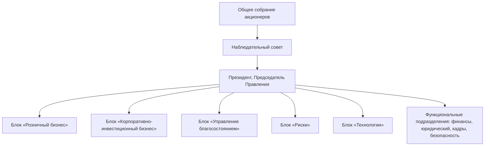
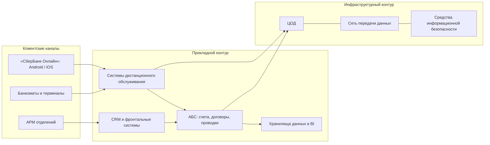
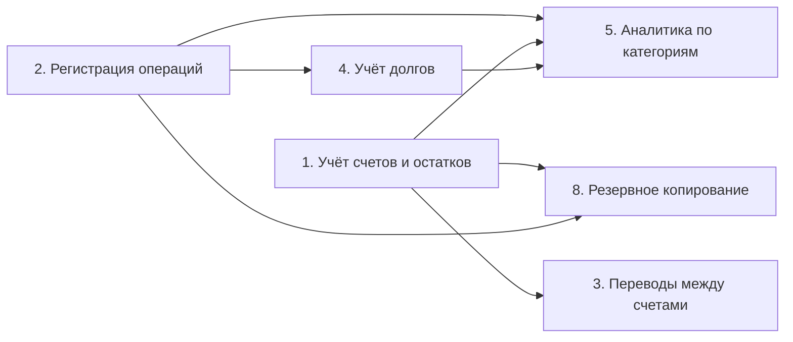
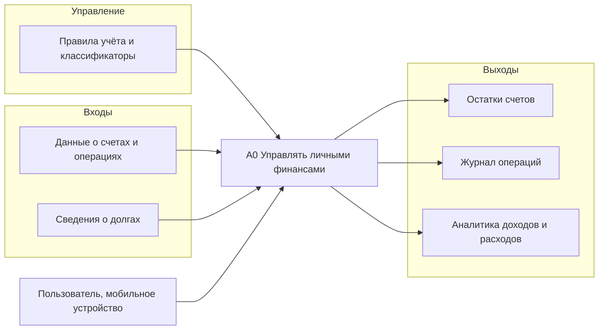
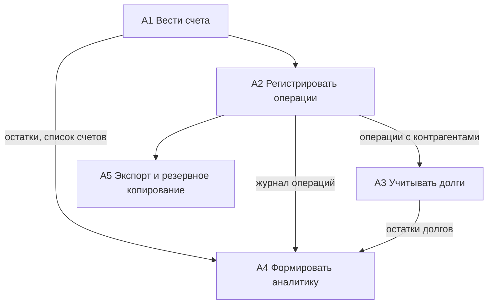
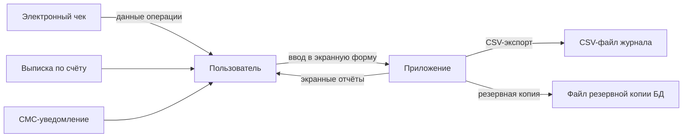

# Глава 1. Аналитическая часть

## 1.1 Технико-экономическая характеристика предметной области и предприятия. Анализ деятельности «КАК ЕСТЬ»

### 1.1.1 Характеристика предприятия и его деятельности

ПАО «Сбербанк» — крупнейший банк Российской Федерации и один из крупнейших
банков Восточной Европы. Банк ведёт историю с 1841 года, имеет генеральную
лицензию Банка России, а контрольный пакет акций принадлежит государству.
Основные направления деятельности:

- обслуживание физических лиц: вклады, карты, кредиты, ипотека, переводы,
  мобильный банк «СберБанк Онлайн»;
- обслуживание корпоративных клиентов: расчётно-кассовое обслуживание,
  кредитование, инвестиционные услуги;
- инвестиционный бизнес и управление активами;
- небанковские экосистемные сервисы (e-commerce, доставка, здоровье,
  развлечения, телеком).

Ключевой канал взаимодействия с частными клиентами — мобильное приложение
«СберБанк Онлайн», через которое клиенты оплачивают покупки, переводят
средства, оформляют продукты и получают сервисы экосистемы.

Показатели деятельности банка приведены в таблице 1.1. Значения —
ориентировочные, по публичным годовым отчётам; **перед включением в ВКР
сверить с годовым отчётом за актуальный период**.

**Таблица 1.1 — Основные показатели деятельности ПАО «Сбербанк»**

| Показатель | Единица измерения | Значение |
| --- | --- | --- |
| Активы (по МСФО) | трлн руб. | свыше 60 |
| Чистая прибыль за год (по МСФО) | трлн руб. | ≈ 1,5 |
| Активные розничные клиенты | млн чел. | ≈ 110 |
| Пользователи приложения «СберБанк Онлайн» | млн чел. | ≈ 84 |
| Отделения обслуживания | тыс. шт. | ≈ 13 |
| Численность сотрудников | тыс. чел. | ≈ 210–250 |

*Источник: годовые отчёты ПАО «Сбербанк»; значения подлежат сверке.*

### 1.1.2 Организационная структура управления предприятием

Организационная структура ПАО «Сбербанк» — линейно-функциональная, с
выделенными бизнес-блоками, обслуживающими клиентские сегменты и
поддерживающими функции. Упрощённая схема приведена на рисунке 1.1.

*Рисунок 1.1 — Упрощённая организационная структура ПАО «Сбербанк»*

Описание структуры:

- высший орган управления — Общее собрание акционеров; стратегическое
  управление осуществляет Наблюдательный совет;
- оперативное управление ведёт Правление во главе с Президентом,
  Председателем Правления;
- блок «Розничный бизнес» отвечает за продукты и сервисы для физических
  лиц, включая мобильное приложение «СберБанк Онлайн» и задачу управления
  личными финансами клиентов;
- блок «Технологии» (СберТех) обеспечивает разработку, эксплуатацию
  и сопровождение информационных систем банка;
- блок «Риски» и функциональные подразделения обеспечивают управление
  рисками, информационную безопасность и поддержку деятельности.

### 1.1.3 Программная и техническая архитектура ИС предприятия

**Программная архитектура.** ИТ-ландшафт банка — распределённая
многоуровневая система, ядро которой составляют:

- автоматизированная банковская система (АБС) — учёт счетов, договоров,
  проводок; исторически централизованная, эволюционирует в сторону
  микросервисной платформы;
- процессинговые системы и системы дистанционного банковского обслуживания,
  включая мобильное приложение «СберБанк Онлайн» и СМС-информирование;
- платёжная инфраструктура: шлюзы Банка России, системы быстрых платежей
  (СБП), межбанковские расчёты;
- CRM и фронтальные системы отделений;
- хранилища данных и BI-платформы аналитики.

**Техническая архитектура.** Инфраструктура банка включает:

- собственные и арендуемые центры обработки данных (ЦОД) на территории РФ;
- телекоммуникационную сеть, объединяющую ЦОД, отделения и банкоматную
  сеть; банкоматы и терминалы самообслуживания;
- АРМ сотрудников (отделения, контакт-центры) и средства печати
  документов.

Упрощённая схема программной и технической архитектуры приведена на
рисунке 1.2.

*Рисунок 1.2 — Упрощённая программная и техническая архитектура ИС ПАО «Сбербанк»*

**Вывод по разделу 1.1.** Мобильный канал — основной канал обслуживания
частных клиентов; при этом существующее приложение банка показывает только
счета самого банка и не решает задачу сводного учёта личных финансов клиента
(наличные, счета других банков, долги). Это формирует предпосылки для
автоматизации, рассматриваемой в разделе 1.2.

### 1.1.4 Системный контекст проектируемого приложения (C4)

Проектируемая система — однопользовательское офлайн-приложение: механизмы
регистрации, аутентификации и коллективного доступа отсутствуют, единственная
роль — владелец устройства. Системный контекст включает два внешних субъекта:
пользователя и файловую систему устройства (рисунок 1.3). Сетевых внешних
систем в фактической архитектуре нет.

*Рисунок 1.3 — Системный контекст проектируемого приложения (C4)*

### 1.1.5 Характеристика платформы и технико-экономические показатели проекта

Единственной поддерживаемой платформой проекта является Android. Каталоги
`web/` и `windows/` сохранены как каркас Flutter-проекта, но не собираются
и не тестируются; поэтому в работе не заявляется кроссплатформенность:
Flutter используется как технология разработки, а целевой и проверяемой
платформой является Android. Технико-экономические показатели проекта
сведены в таблицу 1.2 (фактические значения — по [ARCHITECTURE.md](../architecture/ARCHITECTURE.md)).

**Таблица 1.2 — Технико-экономические показатели проекта**

| Показатель | Значение |
| --- | --- |
| Целевая платформа | Android |
| Язык и UI-фреймворк | Dart, Flutter |
| Управление состоянием | Riverpod |
| Локальная БД | SQLite, доступ через Drift |
| Версия схемы БД / число таблиц | 7 / 8 |
| UI-фич | 6 (accounts, debts, transactions, analytics, settings, bootstrap) |
| Тестовых файлов / автоматизированных тестов | 63 / 449 |
| Файлов Dart в `lib/` / объём без `*.g.dart` | 129 / ≈ 22 тыс. строк |
| Backend / API | отсутствует |
| Локализация | русский и английский |

## 1.2 Характеристика комплекса задач, задачи и обоснование необходимости автоматизации

### 1.2.1 Выбор комплекса задач автоматизации и характеристика существующих бизнес-процессов

Анализ деятельности частного клиента банка «как есть» позволяет выделить
комплекс задач управления личными финансами:

1. учёт остатков по счетам и картам разных банков, включая наличные;
2. регистрация операций доходов и расходов;
3. переводы между собственными счетами, в том числе в разных валютах;
4. учёт долгов и займов между людьми;
5. анализ доходов и расходов по категориям и периодам;
6. планирование бюджета по категориям;
7. хранение чеков и документов по операциям;
8. резервное копирование и перенос финансовых данных между устройствами.

В детализированном виде комплекс автоматизации включает:

1. управление книгой учёта;
2. управление счетами;
3. ведение справочника банков;
4. ведение справочника валют;
5. управление категориями;
6. регистрацию доходов;
7. регистрацию расходов;
8. регистрацию переводов;
9. учёт долгов;
10. анализ операций;
11. экспорт журнала;
12. резервное копирование;
13. восстановление;
14. переключение между локальными базами.

Для выбора приоритетной задачи задачи оцениваются по критериям: частота
выполнения, трудоёмкость «как есть», ценность автоматизации, сложность
реализации (таблица 1.3).

**Таблица 1.3 — Оценка задач комплекса**

| № | Задача | Частота | Трудоёмкость «как есть» | Ценность | Сложность | Приоритет |
| --- | --- | --- | --- | --- | --- | --- |
| 1 | Учёт счетов и остатков | ежедневно | средняя | высокая | низкая | высокий |
| 2 | Регистрация операций | ежедневно | высокая | высокая | низкая | высокий |
| 3 | Переводы между счетами | еженедельно | средняя | высокая | средняя | высокий |
| 4 | Учёт долгов | ежемесячно | высокая | высокая | средняя | высокий |
| 5 | Аналитика по категориям | ежемесячно | высокая | высокая | средняя | высокий |
| 6 | Планирование бюджета | ежемесячно | высокая | средняя | высокая | средний |
| 7 | Хранение чеков | по мере | средняя | средняя | высокая | низкий |
| 8 | Резервное копирование | ежеквартально | средняя | высокая | низкая | высокий |

Наиболее приоритетными и взаимосвязанными являются задачи 1–5 и 8: они
образуют ядро процесса «учёт и анализ личных финансов» и автоматизируются
в составе одного мобильного приложения. Задачи 6–7 выделены в перспективу
развития и в объём данной работы не входят.

Приоритетной задачей автоматизации является ведение финансовых операций:
именно операция служит исходным элементом всех последующих расчётов —
изменения остатка счёта, изменения остатка долга, записи журнала
и аналитических показателей. Автоматизация операции, таким образом,
обеспечивает автоматизацию значительной части зависимых задач комплекса.

**Бизнес-процесс «как есть».** Сегодня клиент ведёт учёт вручную:
записывает расходы в заметки или электронные таблицы, сводит остатки по
выпискам нескольких банков, а долги фиксирует «в уме» или в переписке.
Процесс характеризуется: многократным ручным вводом, ошибками и пропуском
операций, невозможностью оперативного контроля остатков и отсутствием
единой аналитики.

### 1.2.2 Определение места проектируемой задачи в комплексе задач и её описание

Проектируемая задача — «мобильное приложение учёта личных финансов» —
занимает центральное место в комплексе: данные о счетах и операциях,
создаваемые задачами 1–3, являются входными для учёта долгов (задача 4)
и аналитики (задача 5), а задача 8 обеспечивает сохранность всех данных.
Взаимосвязь задач показана на рисунке 1.4.

*Рисунок 1.4 — Место проектируемой задачи в комплексе задач*

**Описание проектируемой задачи.** Приложение позволяет пользователю:

- вести несколько книг учёта (например, «личные финансы», «семейный
  бюджет», «бизнес»), внутри книги — счета с начальными остатками,
  сгруппированные по валютам, с архивированием неиспользуемых счетов;
- регистрировать операции трёх видов: «Доход», «Расход» и «Перевод»,
  включая мультивалютный перевод с расчётом курса по суммам;
- вести долги: книга контрагентов с остатком долга по направлениям
  и валютам, закрытие долга и архив закрытых долгов;
- пользоваться справочниками банков, категорий (12 доходных и 28 расходных
  стартовых категорий) и валют (ISO 4217);
- анализировать финансы: месячный срез по категориям и годовой тренд
  с фильтром по счетам;
- экспортировать журнал операций в CSV, создавать резервную копию базы
  одним файлом, восстанавливать из копии и переключаться между базами.

Интерфейс локализован на русский и английский языки.

### 1.2.3 Функциональные и нефункциональные требования к системе

Функциональные требования сведены в таблицу 1.4.

**Таблица 1.4 — Функциональные требования**

| Код | Требование |
| --- | --- |
| FR-01 | Создание и редактирование счёта |
| FR-02 | Архивирование счёта |
| FR-03 | Регистрация дохода |
| FR-04 | Регистрация расхода |
| FR-05 | Регистрация перевода |
| FR-06 | Мультивалютный перевод с расчётом курса по суммам |
| FR-07 | Ведение справочника категорий |
| FR-08 | Ведение справочника банков |
| FR-09 | Учёт долговых контрагентов |
| FR-10 | Просмотр операций контрагента |
| FR-11 | Закрытие и архивирование долга |
| FR-12 | Просмотр аналитики (месячный срез, годовой тренд) |
| FR-13 | Экспорт журнала в CSV |
| FR-14 | Резервное копирование базы одним файлом |
| FR-15 | Восстановление из резервной копии |
| FR-16 | Переключение активной базы данных |
| FR-17 | Локализация интерфейса (RU/EN) |

Нефункциональные требования приведены в таблице 1.5.

**Таблица 1.5 — Нефункциональные требования**

| Категория | Требование |
| --- | --- |
| Доступность | работа без подключения к сети Интернет |
| Производительность | быстрый отклик локальных экранов и CRUD-операций |
| Целостность | транзакционное создание стартовых данных |
| Надёжность | проверка базы перед восстановлением |
| Сопровождаемость | слоистая архитектура |
| Тестируемость | чистые доменные сервисы, покрытые unit-тестами |
| Переносимость | Flutter как единый UI-фреймворк |
| Локализация | русский и английский интерфейс |
| Безопасность | локальное хранение без серверного API |
| Восстанавливаемость | резервная копия в виде отдельного файла |

### 1.2.4 Обоснование необходимости использования вычислительной техники для решения задачи

Применение вычислительной техники для решения задачи обусловлено:

- **объёмом данных:** за год пользователь совершает сотни операций;
  ручной учёт в таблицах требует в десятки раз больше времени, чем ввод
  в мобильном приложении;
- **оперативностью:** остатки и аналитика должны быть доступны в любой
  момент, включая офлайн; бумажный или табличный учёт такой оперативности
  не даёт;
- **точностью:** автоматический пересчёт остатков счетов и долгов
  исключает арифметические ошибки и расхождения, неизбежные при ручном
  учёте;
- **аналитикой:** группировка по категориям, периодам и валютам требует
  агрегации данных, выполнимой только программными средствами;
- **безопасностью:** хранение финансовых данных в защищённом локальном
  хранилище устройства с резервным копированием надёжнее записей
  «на бумаге» и не требует передачи данных третьим лицам.

### 1.2.5 Анализ системы обеспечения информационной безопасности и защиты информации

В рамках решаемой задачи защищаются финансовые данные пользователя: суммы,
остатки, категории, контрагенты долгов. Существующая в банке система
обеспечения ИБ опирается на:

- правовые акты: 149-ФЗ «Об информации…», 152-ФЗ «О персональных данных»,
  ст. 857 ГК РФ и 395-1-ФЗ о банковской тайне, стандарты Банка России;
- организационные меры: политики информационной безопасности, разграничение
  доступа, режим коммерческой тайны, обучение сотрудников;
- технические меры: межсетевые экраны, шифрование каналов (TLS), СКЗИ
  (ГОСТ-криптография), антивирусная защита, мониторинг и противодействие
  мошенничеству.

Проектируемое приложение вписывается в эту систему следующим образом:
данные хранятся только локально на устройстве пользователя и не передаются
в банк и третьим лицам; сетевые каналы приложение не использует вовсе
(полный offline), что минимизирует поверхность атак. Детально средства
защиты проектируемой системы рассмотрены в разделе 2.1.3.

### 1.2.6 Информационные потоки задачи: IDEF0 и документооборот

Для определения информационных потоков задачи построены функциональные
диаграммы IDEF0. Контекстная диаграмма А-0 (рисунок 1.5) описывает задачу
как блок «Управлять личными финансами» с входами (данные о счетах,
операции, долги), выходами (остатки, отчётность, аналитика), управлением
(правила учёта, классификаторы) и механизмом (пользователь и мобильное
устройство).

*Рисунок 1.5 — Контекстная диаграмма IDEF0 (A-0)*

Декомпозиция А0 на работы: А1 «Вести счета», А2 «Регистрировать операции»,
А3 «Учитывать долги», А4 «Формировать аналитику», А5 «Выполнять экспорт
и резервное копирование» (рисунок 1.6). В тексте ВКР диаграммы заменяются
на рисунки, построенные в специализированном средстве моделирования
(Ramus, BPwin и т. п.), с сохранением имён блоков и стрелок.

*Рисунок 1.6 — Декомпозиция A0 (IDEF0)*

**Документооборот задачи.** Источниками первичной информации для ввода
операций служат документы: электронный кассовый чек (ФЗ-54), выписка по
счёту банка, квитанция об оплате услуг, СМС-уведомление банка. Пользователь
переносит данные из документа в приложение, после чего документ хранится
отдельно (задача хранения чеков вынесена в перспективу). Выходные
документы приложения — журнал операций, отчёт о доходах и расходах по
категориям, экспортный CSV-файл и файл резервной копии базы. Схема
документооборота приведена на рисунке 1.7.

*Рисунок 1.7 — Схема документооборота задачи*

**Таблица 1.6 — Прагматические характеристики документов задачи**

| Документ | Направление | Периодичность | Время на обработку, мин | Исполнитель |
| --- | --- | --- | --- | --- |
| Электронный кассовый чек | входной | по каждой покупке | 0,5–1 (перенос суммы и категории) | пользователь |
| Выписка по счёту | входной | ежемесячно | 10–30 (сверка операций) | пользователь |
| СМС-уведомление банка | входной | по каждой операции | 0,5 | пользователь |
| Журнал операций | результатный | по запросу | — | приложение |
| Отчёт по категориям | результатный | ежемесячно | — | приложение |
| CSV-файл журнала | результатный | по запросу | — | приложение |
| Файл резервной копии БД | результатный | по запросу | — | приложение |

Цепочка обработки данных внутри приложения (аналог маршрута документа):
экранная форма → контроллер Riverpod → use case → доменное правило
валидации и расчёта → репозиторий → SQLite → читающий провайдер →
обновлённые экран, журнал или аналитика. Отдельный файловый поток
используется для экспорта и резервного копирования: SQLite → CSV-экспорт
или снимок `VACUUM INTO` → системный диалог сохранения.

## 1.3 Анализ существующих разработок и выбор стратегии автоматизации «КАК ДОЛЖНО БЫТЬ»

### 1.3.1 Анализ существующих разработок для автоматизации задачи

В качестве критериев сравнения решений выбраны: счета; доходы и расходы;
переводы; категории; мультивалютность; учёт долгов; аналитика;
импорт/экспорт; банковская синхронизация; локальный offline-first режим;
резервирование данных; серверная зависимость.

Проанализированы наиболее распространённые решения для управления личными
финансами (таблица 1.7): мобильный банк ПАО «Сбербанк» «СберБанк Онлайн»,
сервисы учёта финансов «Дзен-мани», CoinKeeper, Money Manager, Monefy
и Wallet.

**Таблица 1.7 — Сравнительный анализ существующих разработок**

| Критерий | «СберБанк Онлайн» | «Дзен-мани» | CoinKeeper | Money Manager | Monefy | Wallet | Проектируемое приложение |
| --- | --- | --- | --- | --- | --- | --- | --- |
| Платформа | Android, iOS | Android, iOS, web | Android, iOS | Android, iOS | Android, iOS | Android, iOS | Android |
| Стоимость | бесплатно | подписка | платно | платно | платно | подписка | бесплатно, без рекламы |
| Офлайн-режим | частично | нет | да | да | да | да | полностью |
| Счета разных банков | только счета банка | да (агрегация) | ручной ввод | ручной ввод | ручной ввод | агрегация | ручной ввод |
| Учёт наличных | ограничен | да | да | да | да | да | да |
| Мультивалютные переводы | да, в рамках банка | частично | нет | да | нет | частично | да, с расчётом курса |
| Учёт долгов | нет | частично | нет | нет | нет | нет | да |
| Аналитика по категориям | базовая | расширенная | есть | есть | базовая | есть | месячный срез и годовой тренд |
| Передача данных третьим лицам | — | да, агрегатор | нет | нет | нет | да, агрегатор | нет (полностью локально) |
| Экспорт и резервные копии | выписки | CSV | частично | CSV | нет | частично | CSV, копия базы одним файлом |

**Вывод.** Банковское приложение не решает задачу сводного учёта; рыночные
аналоги либо требуют платной подписки, либо передают банковские данные
агрегаторам, либо не имеют учёта долгов и мультивалютных переводов.
Ни одно из решений не сочетает одновременно полный офлайн, мультивалютность,
учёт долгов и бесплатность. Это подтверждает целесообразность разработки
собственного приложения.

**Преимущества и недостатки решений.**

Проектируемое приложение: преимущества — отсутствие обязательной
регистрации и серверного контура, работа без Интернета, полный контроль
над локальной базой, резервная копия одним файлом, несколько локальных
баз; недостатки — отсутствие банковской синхронизации, многопользовательского
режима и облачных копий, зависимость восстановления от корректности
резервной копии.

Коммерческие продукты (Wallet, CoinKeeper, Monefy и другие) предлагают
более широкий сервисный контур — банковскую синхронизацию, бюджеты,
совместный доступ, облачные функции, — но при этом зависят от внешних
сервисов, тарифной модели и доверия к инфраструктуре агрегатора.
Разрабатываемое приложение сознательно выбирает более узкую модель:
локальный учёт пользователя с полным контролем над файлом базы.

### 1.3.2 Выбор и обоснование стратегии автоматизации задачи

Стратегия автоматизации определена сравнением состояния «как есть»
(ручной учёт в заметках и таблицах) с целевым состоянием «как должно быть»
(единое мобильное приложение локального учёта). Выбрана стратегия
**автоматизации по направлениям деятельности** с полной автоматизацией
выбранного направления «учёт личных финансов»: задачи 1–5 и 8 комплекса
автоматизируются целиком, смежные задачи (планирование бюджета, хранение
чеков) остаются на перспективу. Обоснование: направление замкнуто по
данным (счета → операции → долги → аналитика), автоматизируется независимо
от остальных задач, а поэтапное внедрение снижает риски проекта.

### 1.3.3 Выбор и обоснование способа приобретения ИС для автоматизации задачи

Рассмотрены три способа приобретения ИС: покупка готового решения, заказная
разработка у подрядчика, собственная разработка. Выбрана **собственная
разработка** на кроссплатформенном фреймворке Flutter. Обоснование:

- ни одно готовое решение не удовлетворяет требованиям офлайна,
  мультивалютности, учёта долгов и бесплатности одновременно (раздел 1.3.1);
- заказная разработка экономически нецелесообразна для некоммерческого
  приложения и затрудняет развитие функциональности;
- собственная разработка на Flutter обеспечивает одну кодовую базу для
  Android (и потенциально других платформ), открытый исходный код,
  отсутствие лицензионных отчислений и полный контроль над безопасностью
  хранения данных;
- современный инструментарий (Flutter, Drift, Riverpod) позволяет создать
  приложение силами одного разработчика в сроки, приемлемые для ВКР,
  с подтверждением качества автоматическими тестами (449 тестов
  в репозитории).

## 1.4 Обоснование проектных решений

### 1.4.1 Обоснование проектных решений по информационному обеспечению

- **Классификаторы:** валюты — международный классификатор ISO 4217
  (около 170 валют); банки — внутрисистемный справочник банков (около
  200 записей с фирменными цветами и доменами иконок); категории —
  внутрисистемный иерархический справочник с 12 категориями доходов
  и 28 категориями расходов, создаваемый при первом запуске. Источники —
  [docs/reference-data](../reference-data/).
- **Документы:** входные — экранные формы (счёт, операция, контрагент,
  категория); результатные — журнал операций, отчёты аналитики, CSV-файл,
  файл резервной копии.
- **Информационная база:** локальная реляционная БД SQLite (8 таблиц,
  схема версии 7), файловый реестр баз и файлы экспорта в хранилище
  приложения. Выбор SQLite обоснован встроенностью в мобильные ОС,
  отсутствием сервера администрирования и транзакционной целостностью.
- **Денежные значения.** Суммы хранятся в целых минорных единицах
  (например, 1 234,56 RUB → 1 234 56 копеек, то есть 123 456 единиц),
  что исключает накопление ошибок округления, возможных при хранении
  денежных значений в формате с плавающей точкой. Отображение суммы
  пользователю выполняется отдельно от хранения.
- **Система кодирования.** Идентификаторы сущностей — UUID (36 символов,
  пакет `uuid`); валюта — буквенный код ISO 4217; вид операции — коды
  `kind` (income / expense / transfer); долговая роль — коды `debtRole`
  (четыре значения); настройки — строковый ключ; версия схемы БД — целое
  число; базы данных — записи файлового реестра.

### 1.4.2 Обоснование проектных решений по программному обеспечению

| Компонент | Выбор | Обоснование |
| --- | --- | --- |
| Операционная система | Android (минимальная версия по умолчанию Flutter) | целевая платформа массовых смартфонов; приложение не требует серверной ОС |
| Язык и фреймворк | Dart, Flutter | кроссплатформенность, высокая производительность UI, единая кодовая база |
| СУБД | SQLite через ORM Drift | встроенная реляционная СУБД, типобезопасные запросы, миграции схемы |
| Управление состоянием и DI | Riverpod | композиция зависимостей и реактивность с тестируемостью без кодогенерации |
| Локализация | `flutter gen-l10n` (ru, en) | штатный механизм Flutter, русский по умолчанию |
| Среда разработки | VS Code + Flutter SDK | основная среда разработки Flutter-приложений |
| Контроль версий и выпуск | Git, GitHub, GitHub Actions | версионирование кода; workflow [release.yml](../../.github/workflows/release.yml) собирает и публикует APK по тегу `v*` |
| Прочие пакеты | `file_picker` (SAF-диалоги), `flutter_slidable`, `intl`, `path_provider`, `uuid` | системные диалоги сохранения/выбора файлов, свайп-действия, форматирование, пути хранилища, идентификаторы |

### 1.4.3 Обоснование проектных решений по техническому обеспечению

**Целевое устройство пользователя:** смартфон или планшет под управлением
Android с объёмом ОЗУ от 2–4 ГБ и свободным хранилищем от 100 МБ —
требования минимальны, так как вычисления локальные, а база данных
компактна. Серверное оборудование не требуется: приложение полностью
офлайн, данные хранятся на устройстве.

**АРМ разработчика:** персональный компьютер под управлением Windows
с 16 ГБ ОЗУ, достаточным для сборки Android-приложений; сеть необходима
только на этапах установки инструментов и публикации релизов. Дополнительные
устройства (тестовые смартфоны, периферия) не требуются: отладка выполняется
на эмуляторе Android и средствами Flutter.
