# Глава 2. Проектная часть

## 2.1 Разработка проекта автоматизации

### 2.1.1 Этапы жизненного цикла проекта автоматизации

Для организации разработки выбран стандарт ГОСТ 34.601-90 «Автоматизированные
системы. Стадии создания» в сочетании с положениями ГОСТ Р ИСО/МЭК 12207.
Модель жизненного цикла — **итерационно-инкрементальная** (адаптация
каскадной модели с короткими итерациями). Выбор обоснован:

- требования к приложению уточняются по мере опытной эксплуатации
  (личные финансы — изменчивая предметная область);
- инкременты функциональности можно проверять независимо (счета →
  операции → переводы → долги → аналитика → экспорт), что подтверждается
  историей изменений репозитория;
- модель соответствует ограниченным ресурсам разработки (один разработчик)
  и позволяет демонстрировать работоспособную версию после каждой итерации.

Этапы жизненного цикла проекта:

1. **Формирование требований** — анализ предметной области, обследование
   «как есть», определение функций и ограничений, техническое задание.
2. **Проектирование** — информационная модель, структура базы данных,
   состав модулей, интерфейсные решения (ADR, OpenSpec-спецификации).
3. **Реализация** — кодирование слоёв `data`, `domain`, `ui` на Dart/Flutter,
   миграции схемы БД, локализация.
4. **Тестирование** — модульное и виджетное тестирование (`flutter test`),
   статический анализ (`dart analyze`), исправление дефектов.
5. **Опытная эксплуатация** — контрольный пример на реальных данных,
   оценка соответствия требованиям.
6. **Сопровождение** — резервное копирование, обновление справочников,
   выпуск релизов (GitHub Actions).

### 2.1.2 Ожидаемые риски на этапах жизненного цикла и их описание

**Таблица 2.1 — Риски проекта и меры по их снижению**

| Этап | Риск | Последствия | Меры снижения |
| --- | --- | --- | --- |
| Формирование требований | Неполнота требований к учёту долгов и мультивалютности | перепроектирование на поздних этапах | фиксация решений в ADR и OpenSpec; приоритизация задач комплекса |
| Проектирование | Ошибки информационной модели | несовместимость данных, повторные миграции | нормализация схемы, ревизия ER-модели перед реализацией |
| Реализация | Технологические риски (обновления Flutter, несовместимость пакетов) | задержки сборки | фиксация версий в `pubspec.yaml`, совместимые пакеты, автотесты |
| Реализация | Дефекты расчётной логики (остатки, курсы, долги) | неверные финансовые данные | вынос расчётов в чистые функции-правила (`*_rule.dart`) с unit-тестами |
| Тестирование | Пропуск регрессий при добавлении функций | дефекты в выпущенной версии | автоматические тесты (449 тестов), прогон `flutter test` в CI-пайплайне |
| Опытная эксплуатация | Неудобство интерфейса, непонятные сценарии | отказ пользователей от приложения | локализация ru/en, стартовые данные при первом запуске, контрольный пример |
| Сопровождение | Потеря данных пользователя | невосстановимые финансовые потери | резервное копирование `VACUUM INTO`, конвейер восстановления с валидацией |
| Весь проект | Компрометация данных (несанкционированный доступ) | утечка финансовых сведений | локальное хранение, отсутствие сетевых каналов, средства раздела 2.1.3 |

### 2.1.3 Организационно-правовые и программно-аппаратные средства обеспечения информационной безопасности и защиты информации

**Организационно-правовые средства:**

- разработка и эксплуатация приложения ведутся в соответствии с 149-ФЗ
  «Об информации, информационных технологиях и о защите информации»
  и 152-ФЗ «О персональных данных»: приложение не передаёт данные
  оператору и третьим лицам, что сводит обработку персональных данных
  к действиям самого пользователя;
- на приложение распространяются требования ст. 857 ГК РФ и 395-1-ФЗ
  о банковской тайне — приложение лишь предоставляет пользователю
  инструмент самостоятельного учёта и не запрашивает банковские
  реквизиты доступа;
- правила использования шрифта Open Sans зафиксированы лицензией
  SIL OFL 1.1, регистрируемой в `LicenseRegistry` приложения;
- исходный код и документация ведутся в закрытом репозитории GitHub
  с контролем версий.

**Программно-аппаратные средства:**

- полный офлайн: в приложении нет HTTP-клиентов и сетевых вызовов,
  поэтому отсутствуют каналы утечки данных и поверхность сетевых атак;
- изоляция приложения средствами Android (песочница, права доступа только
  к собственному каталогу);
- защита носителя: данные шифруются средствами Android (полное шифрование
  диска), доступ к файлам — только через системные диалоги SAF;
- целостность данных: транзакции SQLite, проверка восстанавливаемой копии
  базы перед активацией, мягкий перезапуск после переключения базы;
- сохранность данных: резервная копия базы одним файлом (`VACUUM INTO`)
  и восстановление из копии.

## 2.2 Информационное обеспечение задачи

### 2.2.1 Информационная модель и её описание

Информационная модель представлена диаграммой «сущность — связь»
(рисунок 2.1) и содержит восемь сущностей, что соответствует восьми
таблицам реляционной базы данных.

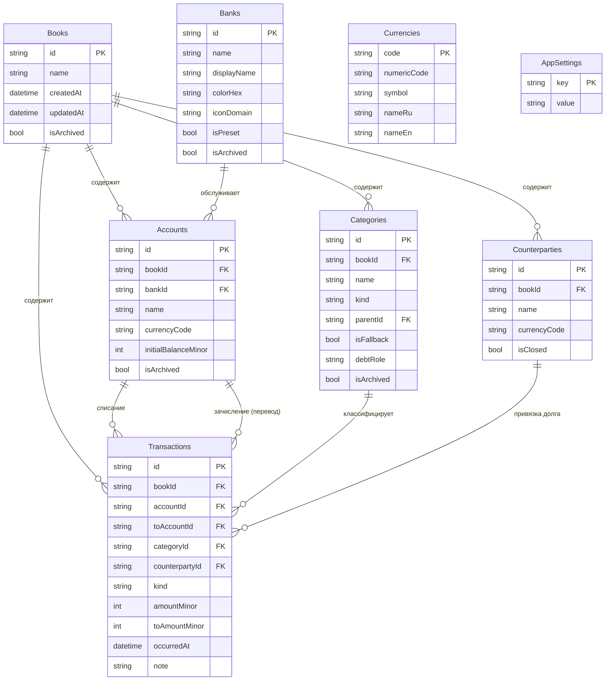

*Рисунок 2.1 — ER-модель базы данных*

Описание модели: центральная сущность `Transactions` (операции) ссылается
на счёт списания `Accounts`, счёт зачисления при переводе, категорию
и контрагента долга; `Accounts` относится к книге учёта `Books` и банку
`Banks`; `Categories` образует иерархию через `parentId` и несёт признак
базовой категории `isFallback` и долговую роль `debtRole`; `Counterparties`
ведёт остаток долга не хранимым полем, а расчётом из привязанных операций;
`Currencies` — справочник валют ISO 4217; `AppSettings` — настройки
приложения. Каждая сущность книги (`Accounts`, `Categories`,
`Counterparties`, `Transactions`) принадлежит ровно одной книге — это
обеспечивает мультибазовый режим приложения.

### 2.2.2 Характеристика нормативно-справочной, входной и оперативной информации

**Таблица 2.2 — Системы кодирования и классификаторы**

| Классификатор | Система кодирования | Объём | Источник | Использование |
| --- | --- | --- | --- | --- |
| Валюты | ISO 4217 (буквенный код — 3 символа, цифровой код — 3 цифры) | ~170 валют | [currencies-iso-4217.md](../reference-data/currencies-iso-4217.md) | счета, переводы, отображение сумм |
| Банки | внутрисистемный идентификатор (UUID 36 символов), наименование, цвет, домен иконки | ~200 банков | [banks.md](../reference-data/banks.md) | карточка счёта |
| Категории | внутрисистемный идентификатор, иерархия `parentId`, тип `kind` (income/expense) | 12 доходных + 28 расходных | [categories.md](../reference-data/categories.md) | классификация операций, аналитика |
| Тип операции | строковый код `kind` (income / expense / transfer) | 3 значения | схема БД | форма операции |
| Долговая роль | строковый код `debtRole` (loanOutflow, loanInflow, refundOutflow, refundInflow) | 4 значения | ADR-0009 | привязка долговых операций |

Идентификаторы сущностей формируются генератором UUID (36 символов),
что исключает коллизии между базами и устройствами.

**Входная и оперативная информация.** Входные документы задачи — первичные
финансовые документы пользователя (электронный чек, выписка, СМС-уведомление);
в приложение информация вводится через экранные формы:

- форма счёта: наименование, банк, валюта, начальный остаток;
- форма операции: вид (доход/расход/перевод), счёт, при переводе — счёт
  зачисления и сумма зачисления, категория, дата, примечание, контрагент
  для долговых категорий;
- форма контрагента: наименование, валюта;
- форма категории: наименование, тип, родительская категория.

Оперативная информация — журнал операций книги, остатки счетов, остатки
долгов контрагентов, настройки приложения.

### 2.2.3 Характеристика результатной информации

Результатная информация приложения:

- экран «Счета» — список счетов с остатками, сгруппированный по валютам;
- экран «Операции» — журнал операций с фильтрами;
- экран «Аналитика» — месячный срез доходов и расходов по категориям
  и годовой тренд по месяцам с фильтром по счетам, по валютным блокам;
- экран «Долги» — контрагенты с остатком долга по направлениям;
- CSV-файл журнала операций (экспорт);
- файл резервной копии базы данных (SQLite-снимок);
- файл восстановления — копия, проверенная и мигрированная до активации.

**Таблица 2.3 — Входные показатели задачи**

| Показатель | Источник | Тип |
| --- | --- | --- |
| Наименование счёта, банк, валюта | форма счёта | справочный |
| Начальный остаток счёта | форма счёта | денежный, в минорных единицах |
| Сумма операции, вид, дата, категория | форма операции | первичный |
| Сумма зачисления перевода | форма операции | расчётный (курс по суммам) |
| Контрагент и валюта долга | форма контрагента | справочный |

**Таблица 2.4 — Результатные показатели задачи**

| Показатель | Алгоритм расчёта | Представление |
| --- | --- | --- |
| Остаток счёта | начальный остаток + доходы − расходы − исходящие переводы + входящие переводы | «Счета» |
| Остаток долга контрагента | знаковая сумма привязанных операций по ролям долга | «Долги» |
| Итог по категории за период | сумма операций категории за полуоткрытый интервал периода | «Аналитика» |
| Помесячный тренд года | суммы по месяцам года, по валютам счетов | «Аналитика» |
| Курс мультивалютного перевода | сумма зачисления ÷ сумма списания | форма перевода |

Расчётные правила изолированы в доменном слое и покрыты unit-тестами
(`account_balance_rule.dart`, `debt_balance_rule.dart`, `analytics_rule.dart`,
`transfer_rate_rule.dart`).

## 2.3 Программное обеспечение задачи

### 2.3.1 Общие положения (дерево функций и сценарий диалога)

Дерево функций приложения приведено на рисунке 2.2.

```mermaid
flowchart TD
    ROOT[Приложение учёта личных финансов]
    ROOT --> F1[Настройка и базы]
    ROOT --> F2[Счета]
    ROOT --> F3[Операции]
    ROOT --> F4[Долги]
    ROOT --> F5[Аналитика]
    ROOT --> F6[Справочники]
    F1 --> F11[Первый запуск и стартовые данные]
    F1 --> F12[Экспорт CSV]
    F1 --> F13[Резервная копия и восстановление]
    F1 --> F14[Переключение баз]
    F2 --> F21[Создание и редактирование счёта]
    F2 --> F22[Остатки по валютам]
    F2 --> F23[Архивирование счёта]
    F3 --> F31[Доход и расход]
    F3 --> F32[Перевод, в т. ч. мультивалютный]
    F3 --> F33[Журнал с фильтрами]
    F3 --> F34[Редактирование и удаление]
    F4 --> F41[Контрагенты и остатки]
    F4 --> F42[Закрытие долга и архив]
    F5 --> F51[Месячный срез по категориям]
    F5 --> F52[Годовой тренд]
    F6 --> F61[Банки, категории, валюты]
```

*Рисунок 2.2 — Дерево функций приложения*

**Сценарий диалога.** Пользователь входит в приложение; при первом запуске
автоматически создаются книга, справочники и стартовые категории. Основная
навигация — четыре вкладки: «Счета», «Операции», «Аналитика», «Настройки»;
долги открываются из раздела «Счета». Из «Счета» пользователь создаёт счёт,
из «Операции» — операцию; выбор долговой категории открывает выбор
контрагента; аналитика отображает срез за период и тренд года с переходом
к списку операций категории. Сценарий диалога показан на рисунке 2.3.

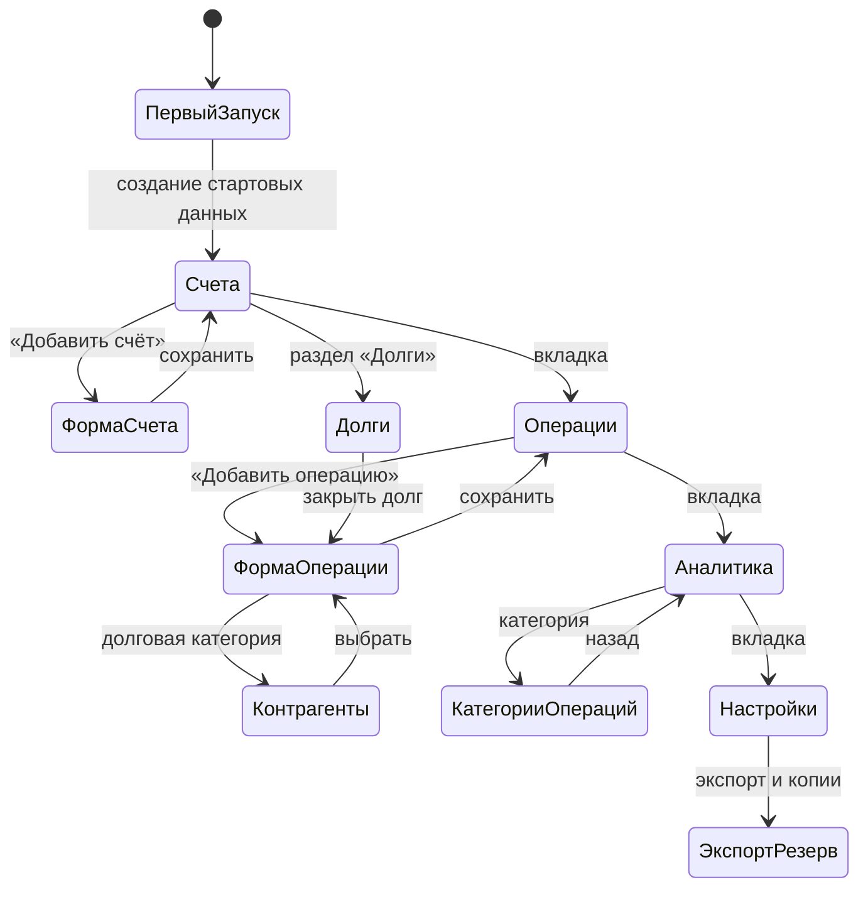

*Рисунок 2.3 — Сценарий диалога*

### 2.3.2 Характеристика базы данных

База данных — SQLite через ORM Drift, схема версии 7, восемь таблиц.
Структура записей приведена в таблицах 2.5–2.12.

**Таблица 2.5 — Books (книги учёта)**

| Поле | Тип | Ограничения | Назначение |
| --- | --- | --- | --- |
| id | TEXT(36) | PK | идентификатор книги |
| name | TEXT | — | наименование книги |
| createdAt, updatedAt | DATETIME | default now | служебные даты |
| isArchived | BOOLEAN | default false | признак архива |

**Таблица 2.6 — Banks (банки)**

| Поле | Тип | Ограничения | Назначение |
| --- | --- | --- | --- |
| id | TEXT(36) | PK | идентификатор банка |
| name | TEXT | — | наименование |
| displayName, displayDetails | TEXT | nullable | отображаемые значения |
| colorHex, iconDomain | TEXT | nullable | фирменный цвет и домен иконки |
| isPreset, isArchived | BOOLEAN | default false | заводская запись, архив |

**Таблица 2.7 — Accounts (счета)**

| Поле | Тип | Ограничения | Назначение |
| --- | --- | --- | --- |
| id | TEXT(36) | PK | идентификатор счёта |
| bookId | TEXT(36) | FK → Books | книга |
| bankId | TEXT(36) | FK → Banks, nullable | банк |
| name | TEXT | — | наименование |
| currencyCode | TEXT(3) | — | валюта счёта |
| initialBalanceMinor | INTEGER | — | начальный остаток в минорных единицах |
| isArchived | BOOLEAN | default false | архив |

Индексы: `idx_accounts_book_id`, `idx_accounts_bank_id`.

**Таблица 2.8 — Categories (категории)**

| Поле | Тип | Ограничения | Назначение |
| --- | --- | --- | --- |
| id | TEXT(36) | PK | идентификатор |
| bookId | TEXT(36) | FK → Books | книга |
| name | TEXT | — | наименование |
| kind | TEXT | — | тип: income / expense |
| parentId | TEXT(36) | FK → Categories, nullable | родительская категория |
| isFallback | BOOLEAN | default false | базовая категория (по одной на тип) |
| debtRole | TEXT | nullable | долговая роль (4 кода) |
| isArchived | BOOLEAN | default false | архив |

**Таблица 2.9 — Counterparties (контрагенты долгов)**

| Поле | Тип | Ограничения | Назначение |
| --- | --- | --- | --- |
| id | TEXT(36) | PK | идентификатор |
| bookId | TEXT(36) | FK → Books | книга |
| name | TEXT | — | наименование |
| currencyCode | TEXT(3) | — | валюта долга |
| isClosed | BOOLEAN | default false | ручное закрытие долга |

**Таблица 2.10 — Transactions (операции)**

| Поле | Тип | Ограничения | Назначение |
| --- | --- | --- | --- |
| id | TEXT(36) | PK | идентификатор операции |
| bookId | TEXT(36) | FK → Books | книга |
| accountId | TEXT(36) | FK → Accounts | счёт списания |
| toAccountId | TEXT(36) | FK → Accounts, nullable | счёт зачисления (перевод) |
| categoryId | TEXT(36) | FK → Categories, nullable | категория |
| counterpartyId | TEXT(36) | FK → Counterparties, nullable | контрагент долга |
| kind | TEXT | — | income / expense / transfer |
| amountMinor | INTEGER | — | сумма списания в минорных единицах |
| toAmountMinor | INTEGER | nullable | сумма зачисления мультивалютного перевода |
| occurredAt | DATETIME | default now | дата операции |
| note | TEXT | nullable | примечание |

Индексы: по книге, счёту, дате и контрагенту.

**Таблица 2.11 — Currencies (валюты)**

| Поле | Тип | Ограничения | Назначение |
| --- | --- | --- | --- |
| code | TEXT(3) | PK | буквенный код ISO 4217 |
| numericCode | TEXT(3) | — | цифровой код |
| symbol | TEXT | nullable | символ валюты |
| nameRu, nameEn | TEXT | — | наименования |

**Таблица 2.12 — AppSettings (настройки)**

| Поле | Тип | Ограничения | Назначение |
| --- | --- | --- | --- |
| key | TEXT | PK | ключ настройки |
| value | TEXT | — | значение |
| updatedAt | DATETIME | default now | дата изменения |

Связи таблиц соответствуют ER-модели рисунка 2.1; количество таблиц
информационной модели равно количеству таблиц ER-модели (восемь), как
требует задание.

### 2.3.3 Структурная схема пакета (дерево вызова программных модулей)

Приложение разделено на три слоя и инфраструктурное ядро (правила —
в [ADR-0007](../adr/0007-architecture-layers-and-directory-structure.md)).
Дерево вызова программных модулей показано на рисунке 2.4.

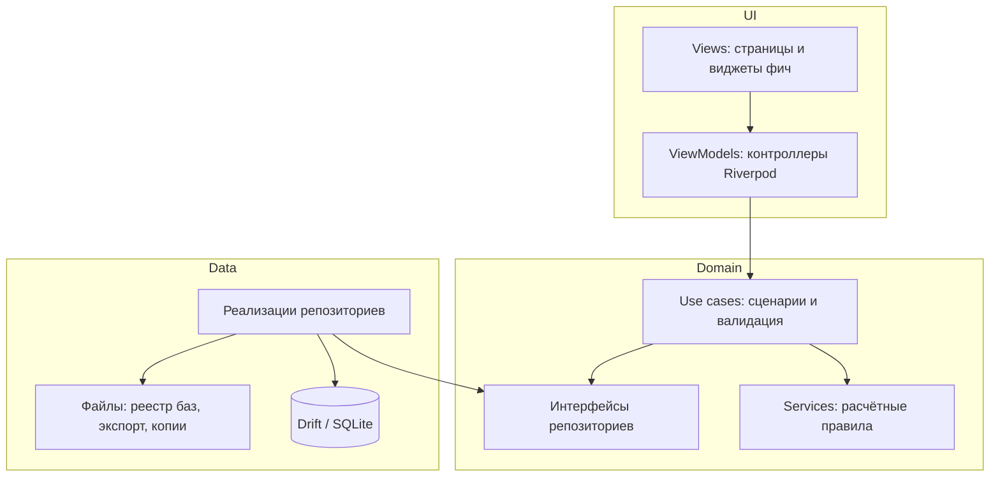

*Рисунок 2.4 — Дерево вызова программных модулей*

**Таблица 2.13 — Перечень и назначение программных модулей**

| Модуль | Слой | Назначение |
| --- | --- | --- |
| `main.dart`, composition root `lib/core/di/` | core | точка входа, сборка графа зависимостей Riverpod |
| контроллеры `view_models/` (accounts, transactions, analytics, debts, settings) | ui | состояние экранов, мутации через use cases, инвалидация провайдеров |
| `AccountUseCases`, `FinanceTransactionUseCases` | domain | сценарии счетов и операций, валидация и коды ошибок |
| `DebtUseCases`, `CategoryUseCases`, `BankUseCases` | domain | долги, категории, банки |
| `AnalyticsUseCases`, `JournalExportUseCases` | domain | агрегаты аналитики, экспорт CSV |
| `DatabaseBackupUseCases`, `DatabaseRestoreUseCases` | domain | резервное копирование и восстановление |
| правила `*_rule.dart` (баланс, курс, долги, аналитика) | domain | чистые функции расчётов |
| `AppDatabase` (Drift), репозитории-реализации | data | хранение SQLite, реестр баз, файлы |
| генератор локализации `flutter gen-l10n` | core | строки интерфейса ru/en |

### 2.3.4 Описание программных модулей

Модули реализуют поток: экранная форма → контроллер → use case →
правило расчёта / репозиторий → база данных, после чего контроллер
инвалидирует затрагиваемые читающие провайдеры и экраны обновляются
реактивно. Мутации счетов, операций и долгов обновляют обзор счетов,
журнал и аналитику одновременно.

**Блок-схема основного расчётного модуля «Учёт операции»** (рисунок 2.5):
модуль принимает данные операции, валидирует их (счёт, суммы, категория,
допустимость привязки контрагента по роли и валюте), для мультивалютного
перевода вычисляет сумму зачисления по правилу курса, сохраняет операцию
транзакционно и инициирует пересчёт читающих провайдеров (остатки, журнал,
долги, аналитика).

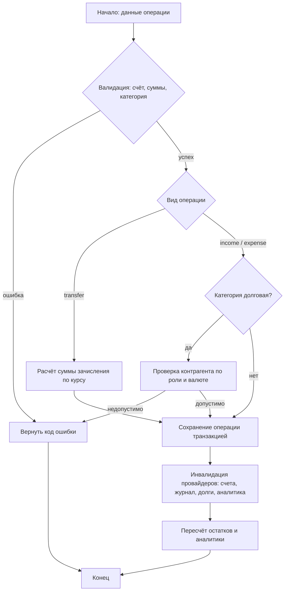

*Рисунок 2.5 — Блок-схема модуля учёта операции*

Аналогично построен модуль пересчёта остатка долга: остаток — знаковая
сумма операций, привязанных к контрагенту, с учётом долговых ролей
категорий; при нулевом остатке долг закрывается автоматически, новая
привязанная операция возвращает контрагента в активные.

## 2.4 Контрольный пример реализации проекта и его описание

Контрольный пример демонстрирует опытную эксплуатацию приложения на
сценарии пользователя. Экранные формы, демонстрирующие работу системы,
представлены на рисунках 2.6–2.13.

**Экранные формы приложения:**

1. **«Счета»** (рисунок 2.6) — список счетов с остатками, сгруппированный
   по валютам, с архивом счетов и разделом «Долги».
2. **«Долги»** (рисунок 2.7) — контрагенты с остатками долга по
   направлениям, закрытие долга, архив закрытых долгов.
3. **«Операции» (журнал)** (рисунок 2.8) — журнал операций с фильтрами;
   свайпом доступны редактирование и удаление.
4. **«Аналитика»** (рисунок 2.9) — месячный срез по категориям и годовой
   тренд с фильтром по счетам и периодам.
5. **«Настройки»** (рисунок 2.10) — справочники, язык интерфейса, экспорт
   CSV, резервное копирование и восстановление, переключение баз.
6. **«Форма операции „Доход“»** (рисунок 2.11) — сумма, счёт, категория,
   дата и примечание; для долговых категорий — выбор контрагента.
7. **«Форма операции „Расход“»** (рисунок 2.12) — те же реквизиты
   для расходной операции.
8. **«Форма операции „Перевод“»** (рисунок 2.13) — счёт списания, счёт
   зачисления и сумма зачисления; для мультивалютного перевода курс
   рассчитывается по суммам.

Экранные формы «Первый запуск» (автоматическое создание книги,
справочников и стартовых категорий) и «Форма счёта» (наименование, банк,
валюта, начальный остаток) участвуют в сценарии ниже и не выносятся
отдельными рисунками.

| | |
| --- | --- |
| 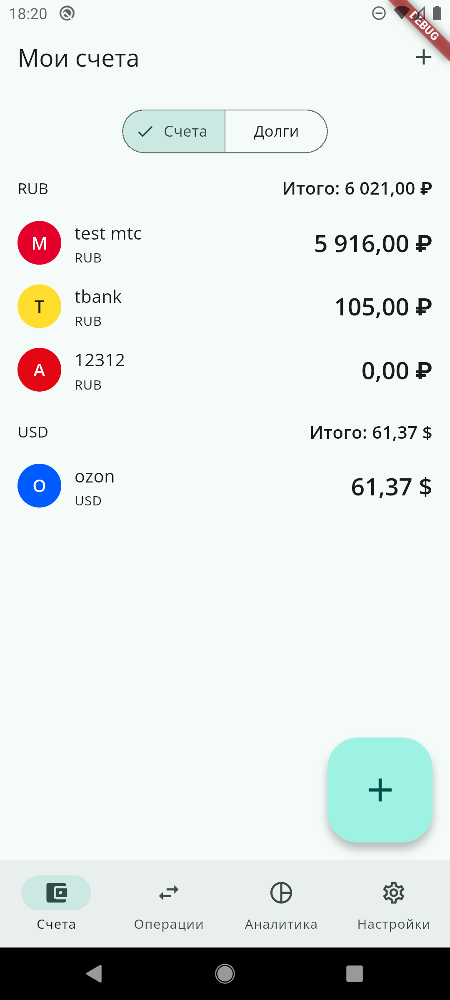 | 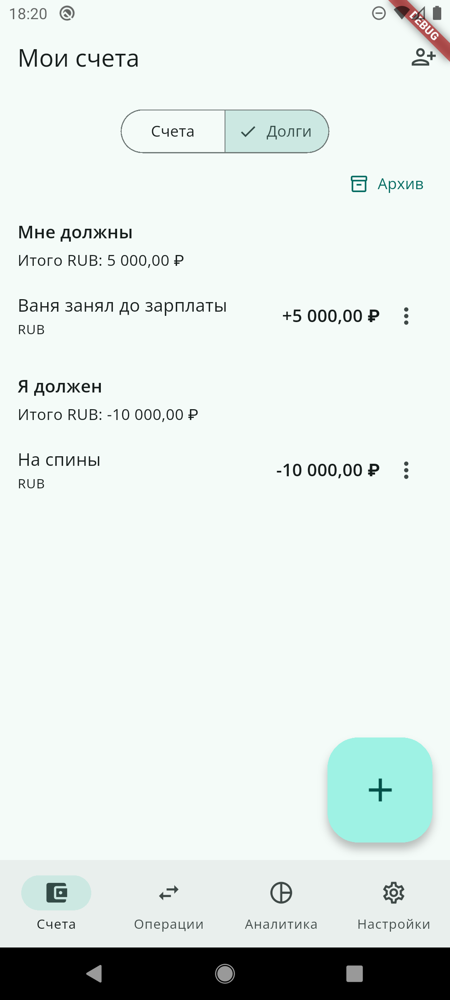 |
| Рисунок 2.6 — Экран «Счета» | Рисунок 2.7 — Экран «Долги» |

| | |
| --- | --- |
| 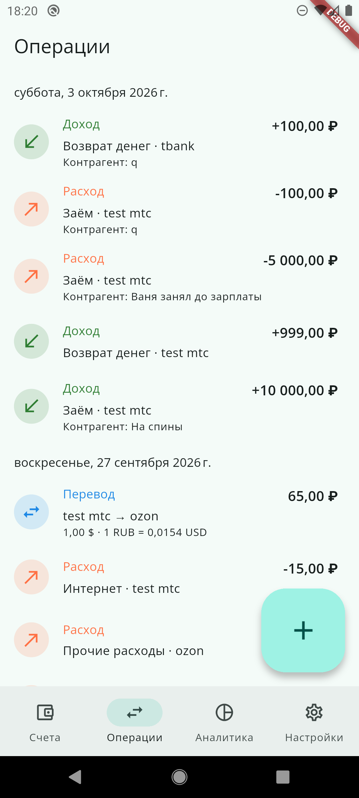 | 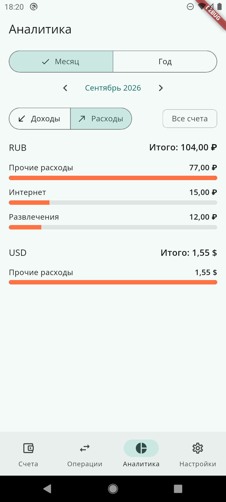 |
| Рисунок 2.8 — Экран «Операции» (журнал) | Рисунок 2.9 — Экран «Аналитика» |

| | |
| --- | --- |
| 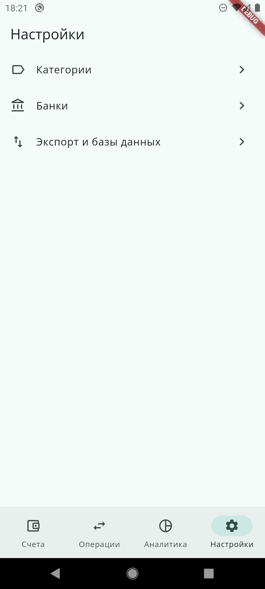 | 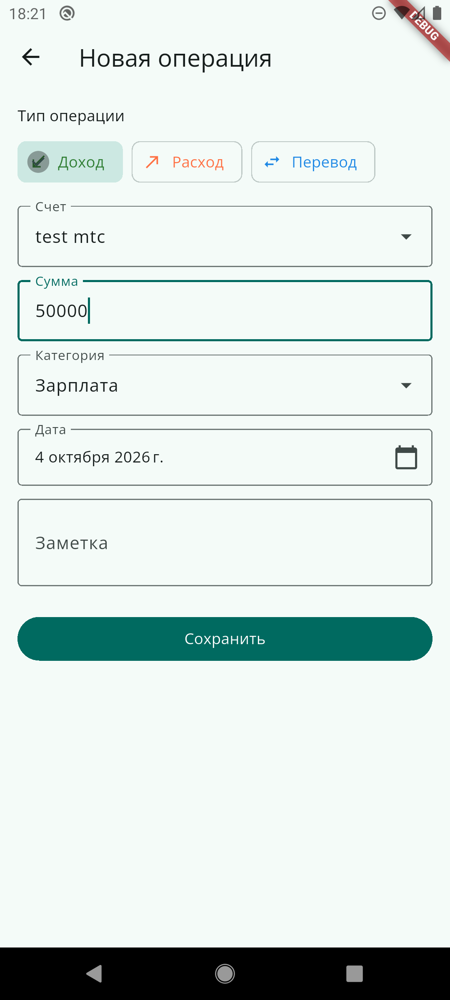 |
| Рисунок 2.10 — Экран «Настройки» | Рисунок 2.11 — Форма операции «Доход» |

| | |
| --- | --- |
| 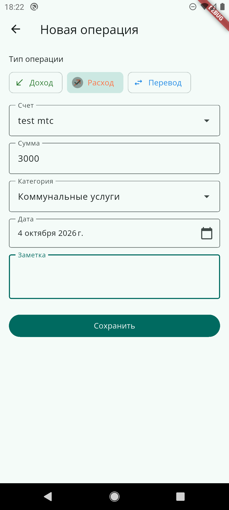 | 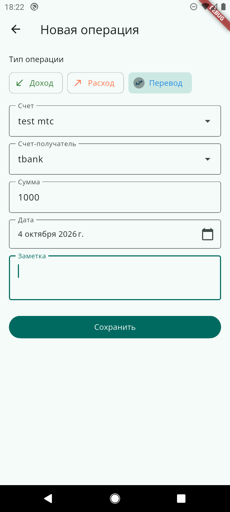 |
| Рисунок 2.12 — Форма операции «Расход» | Рисунок 2.13 — Форма операции «Перевод» |

**Сценарий контрольного примера:**

1. первый запуск: создание стартовых данных;
2. создание счетов «Карта Сбера» (RUB) и «Наличные» (RUB);
3. ввод операций: доход «Зарплата» 80 000 ₽, расход «Продукты» 6 000 ₽,
   расход «Транспорт» 1 500 ₽; проверка остатка 72 500 ₽;
4. мультивалютный перевод: создаётся счёт «Карта USD» (USD), перевод
   10 000 ₽ → 100 USD (курс 100,00); проверка зачисления и остатков;
5. учёт долга: контрагент «Иванов», расход по долговой категории
   «Заём» 5 000 ₽; проверка остатка долга в разделе «Долги»; возврат
   операцией «Возврат денег» и автоматическое закрытие долга;
6. аналитика: месячный срез по категориям и годовой тренд; переход
   к операциям категории;
7. экспорт журнала в CSV и создание резервной копии базы; восстановление
   из копии и переключение между базами.

Каждый шаг контролируется по экранным формам (рисунки 2.6–2.13): остатки
пересчитываются мгновенно, аналитика отражает введённые суммы, а резервная
копия восстанавливает состояние базы.
